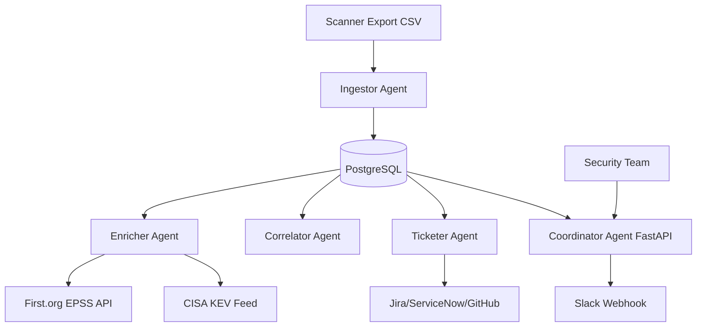

# Vulnerability Triage Co-Pilot

A secure, multi-service vulnerability triage co-pilot designed to automate findings ingestion, enrichment, prioritization scoring, ticketing, and manual approval gates.

## Architecture



## Services

1. **Coordinator**: A FastAPI web server (Port `8080`) providing a web console (`/brief.html`) for manual triage approvals/rejections and a scheduled daily Slack brief (07:00).
2. **Ingestor**: Scans `/data/scanner-exports` for CSV vulnerability files, parses and upserts assets and findings.
3. **Enricher**: Fetches CVE metrics (EPSS score, CISA KEV presence, ExploitDB availability) and caches them in the DB for 24h.
4. **Correlator**: Computes risk-based `priority_score` for all active findings.
5. **Ticketer**: Automatically generates Jira, ServiceNow, or GitHub issue tickets for approved findings, subject to a daily quota of 25 tickets.

---

## Hard Rules

- **Database Auditing**: Every database write operation MUST write to `audit_events` first in the same transaction. Enforced via `execute_write` inside `agents/_lib/db.py`.
- **Approval Constraints**: No tickets or external integration writes are allowed unless `REQUIRE_HUMAN_APPROVAL` is set to `false` or the triage item has been explicitly approved (`triage.status = 'approved'`).
- **Ticket Limit**: The ticketer enforces a maximum of `25` ticket creations in any rolling 24-hour window.
- **Credential Protection**: No secrets are stored in Git or logs. Secrets are defined exclusively in `secrets/.env`.

---

## Getting Started

### 1. Configure Secrets

Copy the example env file and update your configurations:
```bash
cp secrets/.env.example secrets/.env
```

### 2. Start the Stack

Build and start the PostgreSQL database and all 5 services:
```bash
make up
```

### 3. Apply Database Migrations

Initialize database schemas:
```bash
make migrate
```

### 4. Feed/Process Data

Place raw CSV scanner exports into `./data/scanner-exports/`. The Ingestor service will detect and process them automatically. Alternatively, run a manual tick:
```bash
make tick
```

### 5. Review the Gate Monitor

Access the interactive web dashboard:
[http://localhost:8080/brief.html](http://localhost:8080/brief.html)

---

## Makefile Targets

- `make up`: Start all services inside Docker containers.
- `make down`: Stop and clean up all docker containers/volumes.
- `make logs`: View live docker logs.
- `make migrate`: Execute database schema initialization.
- `make tick`: Trigger a one-off run for all pipeline stages (Ingestion -> Enrichment -> Correlation -> Ticketing).
- `make brief`: Generate and log a mock daily Slack brief block.
- `make test`: Run pytest suite.
